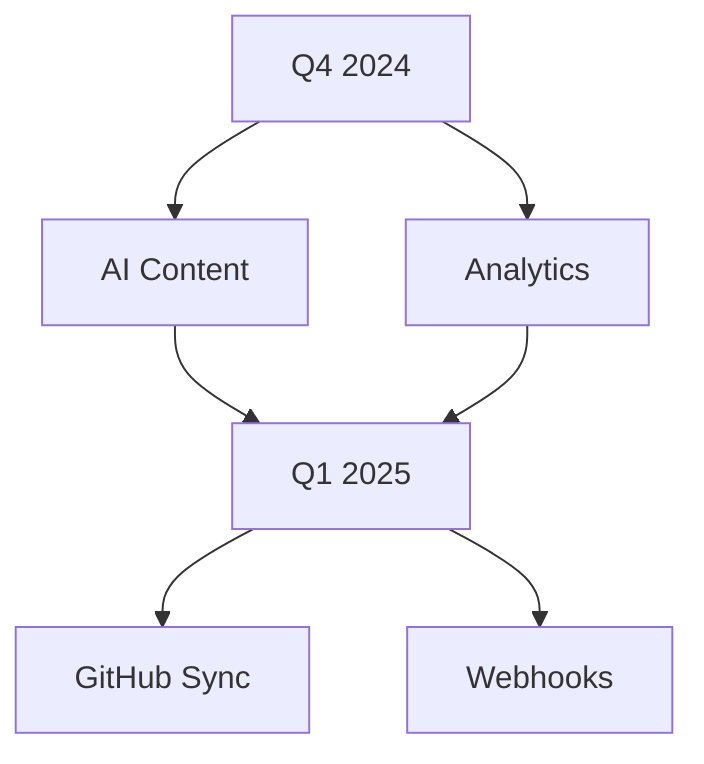

## Recent Updates

<Update label="2024-10-15" description="v1.3.0" tags={["feature", "improvement"]}>

## New Features

- Added real-time collaboration for teams working on documentation pages simultaneously.
- Introduced customizable brand colors, starting with `#3B82F6` as the default blue.
- New MDX component previewer lets you test components before publishing.

## Improvements

- Enhanced search with fuzzy matching and documentation-specific indexing.
- Optimized page load times by `>30%` through lazy-loading components.

## Bug Fixes

- Fixed parsing errors in nested code blocks within JSX components.
- Resolved issues with frontmatter validation on import.

</Update>

<Update label="2024-09-20" description="v1.2.0" tags={["feature", "bugfix"]}>

## New Features

- Integrated `ParamField` and `ResponseField` components for API documentation.
- Added support for Mermaid diagrams as native code blocks.

## Bug Fixes

- Corrected escaping of special characters like `{` and `<` in prose text.
- Patched heading hierarchy enforcement to prevent H1 usage in body content.

## Improvements

- Updated icon library to latest Lucide icons for better visual consistency.

</Update>

<Update label="2024-08-10" description="v1.1.0" tags={["breaking", "feature"]}>

## Breaking Changes

- Removed legacy `<Mermaid>` component; use fenced code blocks only.

## New Features

- Launched `Update` component for changelog entries with tags.
- Enabled multi-language code examples via `CodeGroup`.

## Improvements

- Added validation checklist for MDX parsing errors.

</Update>

## Upgrade Guide

Follow these steps to upgrade Nestor to the latest version.

<Steps>
  <Step title="Backup Your Site" icon="database">

    Export your documentation space.

    ```
    nestor export --site my-docs --output backup.tar.gz
    ```

  </Step>
  <Step title="Update CLI" icon="download">

    Install the latest Nestor CLI.

    <CodeGroup tabs="npm,yarn">
    ````bash
    npm install -g @nestor/cli@latest
    ````
    ````bash
    yarn global add @nestor/cli@latest
    ````
    </CodeGroup>

  </Step>
  <Step title="Deploy Changes" icon="rocket">

    Pull updates and redeploy.

    ```
    nestor pull --remote origin
    nestor deploy --env production
    ```

  </Step>
</Steps>

<Callout kind="tip">
  After upgrading, verify your MDX pages parse correctly using `nestor validate`.
</Callout>

## Upcoming Roadmap

Explore what's next for Nestor.

<Columns cols={2}>
  <Card title="Q4 2024" icon="zap" href="/docs/roadmap#q4">
    AI-powered content generation and advanced analytics.
  </Card>
  <Card title="Q1 2025" icon="trending-up" href="/docs/roadmap#q1">
    Full GitHub integration and webhook support.
  </Card>
</Columns>

<Expandable title="Detailed Roadmap" default-open="false">



</Expandable>

Stay tuned by subscribing to updates at [https://dashboard.example.com/account/notifications](https://dashboard.example.com/account/notifications).