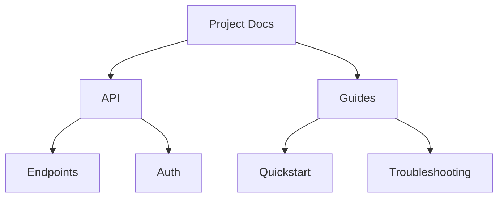

## Overview

Nestor provides powerful tools to manage your project documentation efficiently. You organize content into hierarchical structures, collaborate seamlessly with your team, search across versions, and customize your workspace to fit your needs. These features help you maintain clear, up-to-date docs without complexity.

<Columns cols={2}>
  <Card title="Document Hierarchy" icon="layers" href="#document-hierarchy">
    Build nested folders and pages effortlessly.
  </Card>
  <Card title="Team Collaboration" icon="users" href="#collaboration">
    Real-time editing and review workflows.
  </Card>
  <Card title="Search & Versions" icon="search" href="#search-versions">
    Find content quickly and track changes.
  </Card>
  <Card title="Customization" icon="settings" href="#customization">
    Tailor your space with themes and integrations.
  </Card>
</Columns>

## Document Organization and Hierarchy

You create intuitive folder structures in Nestor to mirror your project's architecture. Start with top-level categories like "API Reference" or "User Guides", then nest subpages for details.



<Steps>
  <Step title="Create Folder" icon="folder">
    Click the `+` button and select "New Folder". Name it to match your section.
  </Step>
  <Step title="Add Pages" icon="file-text">
    Inside folders, create pages with rich MDX content.
  </Step>
  <Step title="Reorder" icon="move">
    Drag and drop to adjust hierarchy.
  </Step>
</Steps>

## Collaboration Tools for Teams

Invite team members to co-edit docs in real-time. You assign roles like Editor or Viewer, and use comments for feedback.

<Tabs>
  <Tab title="Real-time Editing" icon="edit-3">
    Multiple users edit simultaneously. Changes appear instantly.
  </Tab>
  <Tab title="Review Workflow" icon="git-pull-request">
    Create pull requests for docs. Approve before publishing.
  </Tab>
  <Tab title="Notifications" icon="bell">
    Get alerts on mentions or changes via email or Slack.
  </Tab>
</Tabs>

<Callout kind="tip">
  Enable version history to revert accidental changes during collaboration.
</Callout>

## Search and Version Control Features

Nestor indexes all content for fast searches. Filter by keywords, tags, or dates. Every edit creates a version snapshot you restore easily.

<Expandable title="Advanced Search Filters" default-open="false">
  Use operators like `tag:api` or `updated:>2024-01-01` for precise results.
</Expandable>

Track changes with a visual diff viewer showing additions and deletions.

## Customization Options for Projects

Tailor Nestor to your brand. Set custom domains, themes, and integrations.

<CodeGroup tabs="JSON,YAML">
  ```json
  {
    "theme": {
      "primaryColor": "#3B82F6",
      "logoUrl": "https://your-logo.com/logo.png"
    },
    "integrations": {
      "slack": "YOUR_SLACK_WEBHOOK"
    }
  }
  ```
  ```yaml
  theme:
    primaryColor: "#3B82F6"
    logoUrl: https://your-logo.com/logo.png
  integrations:
    slack: YOUR_SLACK_WEBHOOK
  ```
</CodeGroup>

<Callout kind="info">
  Save configs in your project's `.nestorrc` file for version control.
</Callout>

These features integrate seamlessly, letting you scale documentation as your project grows. Start by organizing your hierarchy today.