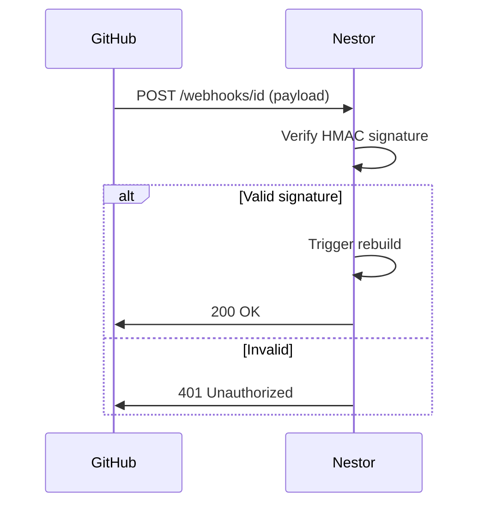

## Overview

Connect Nestor to your favorite tools to automate documentation updates, sync repositories, and extend functionality. You gain seamless integration with version control systems, webhooks for real-time triggers, export/import options for data portability, and API access for custom workflows. Start with built-in integrations or build your own using the API.

<Callout kind="tip">
  Review your Nestor project settings before enabling integrations to ensure proper permissions.
</Callout>

## Supported Integrations

Nestor supports direct connections to popular repository hosts. Use these to automatically pull documentation changes or push updates.

<Columns cols={3}>
  <Card title="GitHub" icon="github" href="https://github.com/marketplace">
    Sync repositories, trigger builds on pull requests, and manage docs from GitHub Apps.
  </Card>
  <Card title="GitLab" icon="git-branch" href="https://gitlab.com">
    Connect projects for CI/CD pipeline integration and merge request notifications.
  </Card>
  <Card title="Bitbucket" icon="git-pull-request" href="https://bitbucket.org">
    Link workspaces to import/export docs and automate deployments.
  </Card>
</Columns>

## Webhook Setup

Set up webhooks to notify Nestor of external events, such as repository updates or deployments. This enables automated documentation refreshes.

<Steps>
  <Step title="Create Webhook" icon="plus">
    In your Nestor dashboard, navigate to Project Settings > Integrations > Webhooks. Click "New Webhook" and copy the generated URL.
  </Step>
  <Step title="Configure Source" icon="settings">
    In your GitHub repository (Settings > Webhooks), paste the Nestor webhook URL. Select events like "Push" or "Pull Request".
  </Step>
  <Step title="Secure Payload" icon="shield">
    Add a secret token from Nestor to verify incoming requests.
  </Step>
  <Step title="Test Connection" icon="zap">
    Trigger a test event and verify the log in Nestor.
  </Step>
</Steps>

Use this sample payload for GitHub webhooks:

<CodeGroup tabs="JavaScript,cURL">
  ````javascript
  // Verify signature in your handler
  const crypto = require('crypto');
  const signature = `sha256=${crypto.createHmac('sha256', 'YOUR_WEBHOOK_SECRET').update(payload).digest('hex')}`;
  if (req.headers['x-hub-signature-256'] !== signature) {
    return res.status(401).send('Unauthorized');
  }
  ````
  ````bash
  curl -X POST https://api.example.com/webhooks/your-webhook-id \
    -H "X-Hub-Signature-256: sha256=..." \
    -H "Content-Type: application/json" \
    -d '{"event": "push", "ref": "refs/heads/main"}'
  ````
</CodeGroup>

## Export and Import Documentation

Export your Nestor docs to Markdown, PDF, or HTML for backups or migration. Import from external sources to populate your space.

<Tabs>
  <Tab title="Export" icon="download">
    From the dashboard, select Export > Format. Download the archive.

    ````bash
    curl -H "Authorization: Bearer YOUR_API_KEY" \
      https://api.example.com/v1/projects/{project_id}/export \
      -o nestor-docs.zip
    ````
  </Tab>
  <Tab title="Import" icon="upload">
    Upload files via dashboard or API. Supports ZIP archives with Markdown files.

    ````bash
    curl -X POST https://api.example.com/v1/projects/{project_id}/import \
      -H "Authorization: Bearer YOUR_API_KEY" \
      -F "file=@docs.zip"
    ````
  </Tab>
</Tabs>

## API Access for Custom Integrations

Build custom connections using Nestor's REST API. Authenticate with a bearer token generated in your account settings.

<ParamField path="project_id" param-type="string" required="true">
  Unique Nestor project identifier.
</ParamField>

<ParamField header="Authorization" param-type="string" required="true">
  Bearer token: `Bearer YOUR_API_KEY`.
</ParamField>

Send a trigger request:

<Request tabs="cURL,JavaScript">
  ````bash
  curl -X POST https://api.example.com/v1/projects/{project_id}/rebuild \
    -H "Authorization: Bearer YOUR_API_KEY" \
    -H "Content-Type: application/json" \
    -d '{"branch": "main"}'
  ````
  ````javascript
  const response = await fetch('https://api.example.com/v1/projects/{project_id}/rebuild', {
    method: 'POST',
    headers: {
      'Authorization': 'Bearer YOUR_API_KEY',
      'Content-Type': 'application/json',
    },
    body: JSON.stringify({ branch: 'main' }),
  });
  ````
</Request>

<Response tabs="200">
  ````json
  {
    "success": true,
    "job_id": "rebuild_abc123",
    "status": "queued"
  }
  ````
</Response>

<Expandable title="Advanced: Webhook Verification Flow" default-open="false">



</Expandable>

<Columns cols={2}>
  <Card title="Quickstart" icon="book-open" href="/quickstart">
    Set up your first Nestor project.
  </Card>
  <Card title="Authentication" icon="lock" href="/authentication">
    Secure your API keys and tokens.
  </Card>
</Columns>